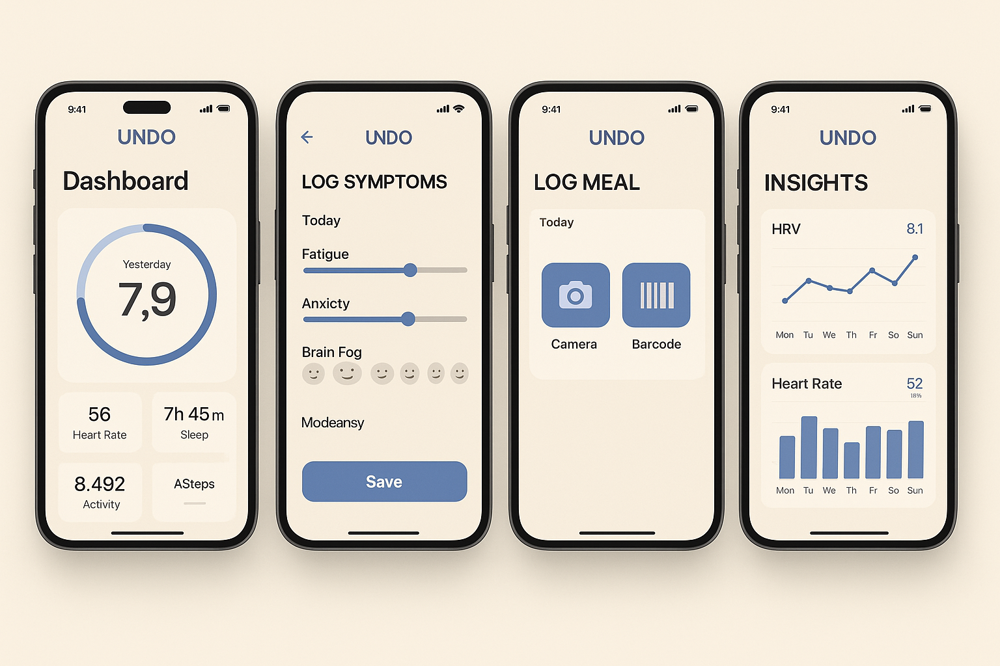

# UNDO Health App

> **Reset Your System, Track Your Wellness, Optimize Your Health Journey**

A comprehensive health tracking application designed for women's wellness, featuring real-time health monitoring, symptom tracking, and personalized insights with professional shadcn/ui components.



## 🌟 Features

### 📊 **Real-Time Health Dashboard**
- **HRV Monitoring** - Heart rate variability tracking with recovery insights
- **Sleep Analysis** - Comprehensive sleep score and composition tracking  
- **Stress Management** - Real-time stress level monitoring with visual progress
- **Body Battery** - Energy level tracking throughout the day
- **Garmin Integration** - Live data from Garmin wearables

### 📝 **Comprehensive Health Tracking**
- **Symptom Logging** - Professional slider-based intensity tracking
- **Mood Tracking** - Interactive emoji-based mood selection
- **Energy Levels** - Visual battery-based energy indicators
- **Voice Input** - Speak your symptoms for quick logging
- **Multiple Input Methods** - Camera, barcode, voice, and manual entry

### 📈 **Advanced Data Visualization**
- **Interactive Charts** - 7/30/90-day trend analysis using Recharts
- **Sleep Insights** - Detailed sleep composition and quality metrics
- **HRV Trends** - Recovery pattern analysis with professional charts
- **Personalized Recommendations** - AI-driven health insights

### 🎨 **Professional UI/UX**
- **shadcn/ui Components** - Industry-standard accessible components
- **UNDO Design System** - Custom warm, calming color palette
- **Mobile-First Design** - Optimized for daily mobile use
- **Accessibility** - WCAG 2.1 AA compliant with screen reader support

## 🚀 Quick Start

### Prerequisites
- Node.js 18+ 
- npm or pnpm package manager
- Modern web browser

### Installation
```bash
# Clone the repository
git clone https://github.com/pinkbalaclava/UNDO.git
cd UNDO

# Install dependencies
pnpm install
# or
npm install

# Start development server
pnpm run dev
# or
npm run dev
```

### Access the App
- **Local development**: http://localhost:5173/
- The app will automatically open in your default browser

## 🛠️ Technology Stack

### **Frontend Framework**
- **React 18** with Vite for fast development
- **TypeScript** support for better development experience
- **Modern ES6+** JavaScript features

### **UI Components & Styling**
- **shadcn/ui** - Professional, accessible component library
- **Tailwind CSS** - Utility-first CSS framework
- **Custom Design System** - UNDO brand colors and typography
- **Lucide React** - Beautiful, consistent icons

### **Data Visualization**
- **Recharts** - Professional charts and graphs
- **Interactive Components** - Real-time data updates
- **Responsive Design** - Works on all screen sizes

### **State Management**
- **React Hooks** - useState, useEffect for local state
- **Real-time Updates** - Live data synchronization
- **Persistent Storage** - Local data retention

## 📱 App Structure

### **Dashboard**
- Real-time health metrics display
- HRV circle with recovery status
- Quick action buttons for logging
- Garmin device connection status

### **Symptom Tracking**
- **Hot Flash Intensity** - Professional slider (0-5 scale)
- **Mood Selection** - Interactive emoji buttons with state management
- **Energy Level** - Visual battery indicators
- **Voice Input** - Speak symptoms for transcription
- **Quick Save** - Rapid daily check-in

### **Health Insights**
- **Trend Analysis** - Interactive charts with multiple time ranges
- **Sleep Breakdown** - Composition analysis (deep, REM, light sleep)
- **Stress Patterns** - Identify triggers and patterns
- **Personalized Recommendations** - Tailored health advice

### **Profile Management**
- **Health Overview** - Statistics and progress tracking
- **Device Management** - Garmin connection controls
- **Settings** - Privacy and notification preferences
- **Medical Information** - Dietary restrictions and supplements

## 🎨 Design System

### **UNDO Color Palette**
```css
--undo-warm-sand: #F6F2EB     /* Primary background */
--undo-soft-charcoal: #1D1D1F /* Text and UI elements */
--undo-recovery-blue: #7ACFD6  /* Health metrics */
--undo-detox-green: #C4FF61    /* Positive indicators */
--undo-dusty-rose: #F2C6C2     /* Accent elements */
```

### **Typography & Spacing**
- **Clean, readable fonts** optimized for health data
- **Consistent sizing** using Tailwind's scale
- **Mobile-first responsive** design principles
- **Professional spacing** with shadcn/ui standards

### **Component Philosophy**
- **Accessibility first** - WCAG 2.1 AA compliance
- **Consistent interactions** - Predictable user experience
- **Professional polish** - Industry-standard components
- **Brand identity** - UNDO's warm, calming aesthetic

## 🔌 Garmin Integration

### **Health API Features**
The app includes a comprehensive mock Garmin API service demonstrating:

- **Real-time Metrics** - HRV, heart rate, stress, body battery
- **Sleep Analysis** - Duration, composition, and quality scores
- **Activity Tracking** - Steps, calories, and exercise data
- **Historical Data** - Trend analysis over multiple time periods

### **Production Setup**
To use real Garmin data:

1. **Register** at [Garmin Developer Portal](https://developer.garmin.com/)
2. **Obtain API credentials** for your application
3. **Replace mock service** in `src/services/garminApi.js`
4. **Configure OAuth** authentication flow

### **Required API Scopes**
```javascript
const scopes = [
  'read:health',      // Health metrics access
  'read:activities',  // Activity data
  'read:sleep',       // Sleep analysis
  'read:stress'       // Stress monitoring
]
```

## 🏗️ Development

### **Available Scripts**
```bash
# Development
pnpm run dev          # Start development server
pnpm run build        # Build for production
pnpm run preview      # Preview production build
pnpm run lint         # Run ESLint

# Testing
pnpm run test         # Run test suite (when implemented)
```

### **Project Structure**
```
src/
├── components/
│   ├── ui/              # shadcn/ui components
│   ├── Insights.jsx     # Health analytics component
│   └── Profile.jsx      # User profile component
├── services/
│   └── garminApi.js     # Garmin API integration
├── assets/              # Images and design assets
├── hooks/               # Custom React hooks
├── lib/                 # Utility functions
├── App.jsx              # Main application component
└── main.jsx             # Application entry point
```

### **Component Architecture**
- **Modular Design** - Reusable, composable components
- **shadcn/ui Integration** - Professional component library
- **Custom Variants** - UNDO-branded component styles
- **Accessibility** - Built-in ARIA attributes and keyboard navigation

## 🚀 Deployment

### **Netlify (Recommended)**
1. **Connect GitHub** repository to Netlify
2. **Configure build settings**:
   - Build command: `pnpm run build`
   - Publish directory: `dist`
   - Branch: `main`
3. **Deploy automatically** on every push

### **Other Platforms**
- **Vercel** - Connect GitHub repo for automatic deployments
- **GitHub Pages** - Deploy static files from `dist` folder
- **Traditional Hosting** - Upload `dist` folder contents

### **Environment Variables**
For production deployment, set these environment variables:
```bash
VITE_GARMIN_CLIENT_ID=your_client_id
VITE_GARMIN_CLIENT_SECRET=your_client_secret
VITE_API_BASE_URL=https://apis.garmin.com
```

## 🔐 Privacy & Security

### **Data Protection**
- **Local Storage** - Health data stored securely on device
- **No Data Collection** - Personal health information never leaves your device
- **Secure API Integration** - OAuth-based Garmin authentication
- **HTTPS Encryption** - All connections secured with SSL

### **Privacy Features**
- **Optional Data Sharing** - User-controlled anonymized research data
- **No Third-Party Tracking** - No analytics or tracking scripts
- **Transparent Permissions** - Clear data usage explanations

## 🤝 Contributing

### **Development Setup**
1. **Fork the repository**
2. **Create feature branch**: `git checkout -b feature-name`
3. **Make changes** and test thoroughly
4. **Commit changes**: `git commit -m 'Add feature'`
5. **Push to branch**: `git push origin feature-name`
6. **Submit pull request**

### **Code Standards**
- **ESLint** configuration for code quality
- **Prettier** for consistent formatting
- **Component documentation** with JSDoc comments
- **Accessibility testing** for all interactive elements

### **Areas for Contribution**
- [ ] Additional wearable device integrations (Apple Watch, Fitbit)
- [ ] Advanced AI health insights
- [ ] Social features and community support
- [ ] Healthcare provider integration
- [ ] Multi-language support

## 📄 License

This project is licensed under the MIT License - see the [LICENSE](LICENSE) file for details.

## 🆘 Support

### **Documentation**
- **User Guide** - Comprehensive usage instructions
- **API Documentation** - Garmin integration details
- **Component Library** - shadcn/ui component usage

### **Getting Help**
- **GitHub Issues** - Report bugs or request features
- **Discussions** - Community support and questions
- **Email Support** - Direct contact for urgent issues

## 🔮 Roadmap

### **Upcoming Features**
- [ ] **Advanced AI Insights** - Machine learning health recommendations
- [ ] **Social Features** - Community support and sharing
- [ ] **Healthcare Integration** - Provider data sharing
- [ ] **Multi-Device Support** - Apple Watch, Fitbit integration
- [ ] **Offline Mode** - Full functionality without internet

### **Version History**
- **v1.0.0** - Initial release with core health tracking
- **v1.1.0** - shadcn/ui integration and accessibility improvements
- **v1.2.0** - Enhanced Garmin integration and real-time updates

## 🙏 Acknowledgments

### **Built With**
- **React** - Frontend framework
- **shadcn/ui** - Component library
- **Tailwind CSS** - Styling framework
- **Recharts** - Data visualization
- **Lucide React** - Icon library
- **Vite** - Build tool

### **Inspiration**
- **Women's Health Community** - Feedback and feature requests
- **Healthcare Professionals** - Medical guidance and validation
- **Open Source Community** - Tools and libraries that made this possible

---

**UNDO Health App** - Empowering women to take control of their health journey through comprehensive tracking, insights, and community support.

For more information, visit our [documentation](docs/) or check out the [deployment guide](docs/deployment.md).

